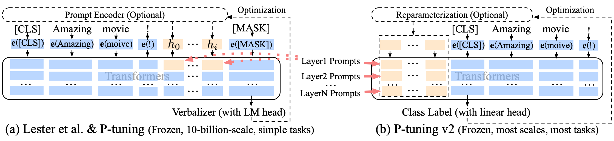

# P-tuning v2


Source codes and data for
* [ACL 2022] [P-Tuning v2: Prompt Tuning Can Be Comparable to Finetuning Universally Across Scales and Tasks](https://arxiv.org/abs/2110.07602) 
* [Findings of EMNLP 2023] [Parameter-Efficient Prompt Tuning Makes Generalized and Calibrated Neural Text Retrievers](https://arxiv.org/pdf/2207.07087.pdf)  [[Code]](https://github.com/THUDM/P-tuning-v2/tree/main/PT-Retrieval)

An optimized prompt tuning strategy achieving comparable performance to fine-tuning on small/medium-sized models and sequence tagging challenges. 

Find our previous version [P-tuning v1](https://github.com/THUDM/P-tuning) for knowledge probing and few-shot SuperGLUE. Your kindly starring our repo can greatly encourage us to work harder :)

You may be also interested in our recent work [GLM-130B: An Open Bilingual Pre-trained Model (2022-10-06)](https://arxiv.org/abs/2210.02414). It is an open-sourced LLM outperforming GPT-3 175B over various benchmarks. Get model weights, do inference and P-Tuning v2 with only **4 * RTX 3090 or 8 * RTX 2080 Ti** [FOR FREE](https://github.com/THUDM/GLM-130B)!

P-tuning v2 leverages **deep prompt tuning**, which is to apply continuous prompts for every layer input of the pretrained transformer. 
Deep prompt tuning increases the capacity of continuous prompts and closes the gap to fine-tuning across various settings, especially for small models and hard tasks.



Thanks [@rainatam](https://github.com/rainatam)'s joint effort in re-organizing codes for publishing!

## Commonly Asked Question
1. Some readers notice a **'mismatch'** in SuperGLUE between P-tuning (v1) and P-tuning v2: This is because in P-tuning's SuperGLUE experiment, for fair comparison to PET, we follow its experimental setting where backbone pre-trained model parameters are jointly tuned with continuous prompt embeddings; while in P-tuning v2, we follow Prefix tuning and Lester et al.'s parameter-efficient setting where backbone pre-trained model parameters are frozen.

## Reproduce Tips
Since experiments reported in our paper are all conducted on NVIDIA DGX-A100 servers (which might be difficult to acquire), 
we reimplement P-tuning v2's results on BERT-large/RoBERTa-large with:

* Ubuntu servers with NVIDIA GeForce RTX 3090 (24G) GPUs
* cuda 11.1
* packages with certain versions (provided below)

We notice that the best hyper-parameters can be sensitive to your server environment and package version. 
If you do not have the exact same environment, we highly recommend you to run hyper-parameter search in your environment
based on our example hyper-parameter search script in [search_script](search_script) and result collection scripts [search.py](search.py).

### Setup
We conduct our experiment with Anaconda3. If you have installed Anaconda3, then create the environment for P-tuning v2:

```shell
conda create -n pt2 python=3.8.5
conda activate pt2
```

After we setup basic conda environment, install pytorch related packages via:

```shell
conda install -n pt2 pytorch==1.7.1 torchvision==0.8.2 torchaudio==0.7.2 cudatoolkit=11.0 -c pytorch
```

Finally, install other python packages we need:

```shell
pip install -r requirements.txt
```

### Data
For SuperGLUE and SQuAD datasets, we download them from the Huggingface Datasets APIs (embedded in our codes).

For sequence tagging (NER, SRL) datasets, we prepare a non-official packup [here](https://zenodo.org/record/6318701/files/P-tuning-v2_data.tar.gz?download=1). 
After downloading, unzip the packup to the project root.
Please use at your own risk.

### Training
Run training scripts in [run_script](run_script) (e.g., RoBERTa for RTE):

```shell
bash run_script/run_rte_roberta.sh
```

### Implemented Results
Currently we have released our reimplementation on following tasks and datasets. More implementation will be released soon.

Released results on BERT-large

|              | BoolQ | COPA | RTE  | WiC  | WSC  | CoNLL04 | OntoNotes 5.0 | CoNLL12 |
|--------------|-------|------|------|------|------|---------|---------------|---------|
| Result       | 74.3  | 77.0 | 80.1 | 75.1 | 68.3 | 84.5    | 86.4          | 85.3    |
| Total Epochs | 100   | 80   | 60   | 80   | 80   | 40      | 30            | 45      |
| Best Epoch   | 58    | 12   | 30   | 56   | 17   | 33      | 24            | 43      |

Released results on RoBERTa-large

|              | BoolQ | COPA | RTE  | WiC  | WSC  | CoNLL03 | CoNLL04 | OntoNotes 5.0 | CoNLL12 | CoNLL05 WSJ | CoNLL05 Brown | SQuAD 1.1 | SQuAD 2.0 |
|--------------|-------|------|------|------|------|---------|---------|---------------|---------|-------------|---------------|-----------|-----------|
| Results      | 84.0  | 92.0 | 86.6 | 73.7 | 64.4 | 91.8    | 88.4    | 90.1          | 84.7    | 89.4        | 83.9          | 88.1/94.2 | 81.3/84.7 |
| Total Epochs | 100   | 120  | 100  | 50   | 10   | 30      | 80      | 60            | 45      | 15          | -             | 30        | 10        |
| Best Epoch   | 86    | 78   | 65   | 31   | 3    | 28      | 45      | 59            | 37      | 13          | -             | 24        | 9         |

For other hyper-parameters, please refer to the training scripts. 
If you can not achieve the reported results at the best epoch, there is probably an environmental mismatch and hyper-parameter search is needed.

## Citation

If you find our work useful, please kindly cite our paper:

```
@article{DBLP:journals/corr/abs-2110-07602,
  author    = {Xiao Liu and
               Kaixuan Ji and
               Yicheng Fu and
               Zhengxiao Du and
               Zhilin Yang and
               Jie Tang},
  title     = {P-Tuning v2: Prompt Tuning Can Be Comparable to Fine-tuning Universally
               Across Scales and Tasks},
  journal   = {CoRR},
  volume    = {abs/2110.07602},
  year      = {2021},
  url       = {https://arxiv.org/abs/2110.07602},
  eprinttype = {arXiv},
  eprint    = {2110.07602},
  timestamp = {Fri, 22 Oct 2021 13:33:09 +0200},
  biburl    = {https://dblp.org/rec/journals/corr/abs-2110-07602.bib},
  bibsource = {dblp computer science bibliography, https://dblp.org}
}
```
